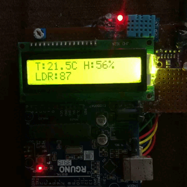

# Arduino Weather Station Pro  
### BMP280 · DHT11 · LDR · Intelligent Pressure‑Trend Forecast

This project turns an Arduino Uno into a compact yet surprisingly capable weather station with:

- Barometric pressure and altitude (BMP280)  
- Temperature from both BMP280 and DHT11  
- Relative humidity (DHT11)  
- Ambient light level (LDR)  
- A **30‑minute barometric trend–based forecast** (e.g., “Storm risk”, “Fair & clear”, “Clouds/rain”)  
- A rotating 16×2 LCD dashboard with multiple “pages” of data  

Everything fits on a standard 16×2 character LCD and uses only common, low‑cost sensors.



***

## Version 2.0

Version 2.0 introduces a major upgrade to the Arduino Weather Station Pro with improved BMP280 integration, a cleaner multi-screen LCD interface, custom weather icons, better fault handling, and a pressure-trend-based forecast engine. The update also improves code structure, sensor polling, and screen readability for the 16×2 LCD format. [1][2][3]

### Added

- Added dedicated BMP280 support for temperature, pressure, and altitude sensing. [1]
- Added a structured multi-screen LCD interface for cleaner presentation on a 16×2 display. [2][4]
- Added custom LCD icons for weather conditions, thermometer, humidity, and rising/falling pressure trend arrows. [2][5]
- Added a dedicated forecast screen showing both pressure tendency and forecast text. [3][6]
- Added pressure history tracking to support short-term trend analysis. [7]
- Added mapped light-level percentage from the LDR raw analog reading. [8]
- Added Serial Monitor debug output for all major sensor values. [1][4]
- Added LCD startup and BMP280 failure messages for easier troubleshooting. [1][7]

### Improved

- Improved screen order so the display now shows DHT data first, BMP data second, other sensor data next, and forecast last after initialization. [2]
- Improved BMP280 display formatting so BMP temperature is clearly visible with shorter LCD-friendly labels. [9][10]
- Improved readability by separating DHT, BMP, LDR, altitude, and forecast data across dedicated screens. [9][4]
- Improved forecast behavior by using 30-minute pressure tendency instead of only instantaneous pressure readings. [3][7]
- Improved sensor polling with separate timed intervals for DHT11, BMP280, and pressure-history logging. [11][1]
- Improved code maintainability by splitting the sketch into helper functions and dedicated screen-rendering functions. [2]

### Fixed

- Fixed the issue where the BMP screen did not visibly show BMP temperature on the LCD. [9][10]
- Fixed text crowding caused by the 16-character limit of the 16×2 LCD. [9][12]
- Fixed invalid sensor overwrite behavior by using `NaN` checks before updating stored values. [1]
- Fixed BMP280 startup handling when the sensor is unavailable at the configured I²C address. [1][7]

### Notes

- DHT11 provides humidity and ambient temperature, while BMP280 provides temperature, pressure, and altitude. [1][4]
- Forecast labels such as `Unsettled`, `Improving`, `Clouds/rain`, and `Storm risk` are heuristic outputs based on local pressure level and short-term pressure trend. [3][6][13]

***

## Features at a glance

- **Dual temperature sensing**  
  - `tB`: BMP280 temperature (high-quality, barometric sensor)  
  - `tD`: DHT11 temperature (for comparison / sanity check)

- **Humidity & comfort**  
  - Relative humidity from DHT11 (`hum` in %)

- **Pressure, altitude & trend**  
  - Sea-level-referenced barometric pressure in hPa  
  - Approximate altitude in meters  
  - 30-minute pressure tendency `dP30m` (hPa change)

- **Ambient light**  
  - Raw LDR reading (0–1023) representing brightness level

- **Smart forecast engine**  
  - Maintains a circular buffer of pressure over ~30 minutes  
  - Computes tendency (rise/fall) and classifies it into:  
    `rapid rise`, `slow rise`, `steady`, `slow fall`, `rapid fall`  
  - Combines trend + absolute pressure + temperature + humidity band  
    to output intuitive forecast labels like:  
    - “Storm risk”  
    - “Clouds/rain”  
    - “Unsettled”  
    - “Hot & clear”  
    - “Fair & clear”  
    - “Stable fair”  
    - “Improving / Worsening / No big change / Similar ahead”

***

## Hardware requirements

- **Arduino Uno** (or compatible 5 V board)
- **BMP280** barometric pressure + temperature sensor (I²C)
- **DHT11** temperature + humidity sensor
- **LDR** (photoresistor) + 10 kΩ resistor for a voltage divider
- **16×2 character LCD** (HD44780 compatible)
- Jumper wires and a breadboard

***

## Wiring

### LCD (16×2, 4‑bit parallel mode)

The sketch uses:

```cpp
const int rs = 12, en = 11, d4 = 5, d5 = 4, d6 = 3, d7 = 2;
LiquidCrystal lcd(rs, en, d4, d5, d6, d7);
```

Typical wiring:

- RS → D12  
- E  → D11  
- D4 → D5  
- D5 → D4  
- D6 → D3  
- D7 → D2  
- VSS → GND  
- VDD → 5 V  
- VO  → contrast potentiometer (10 kΩ between 5 V and GND, wiper to VO)  
- RW  → GND  
- A/K → LCD backlight (through appropriate resistor if needed)

### BMP280 (I²C)

On Arduino Uno, hardware I²C is:

- SDA → A4  
- SCL → A5  

Power:

- VCC → 3.3 V (check your breakout, many tolerate 5 V but confirm)  
- GND → GND  

The code uses I²C address `0x76`:

```cpp
if (!bmp.begin(0x76)) {
    // handle error
}
```

Change to `0x77` if your module is configured that way.

### DHT11

```cpp
#define DHTPIN 7
#define DHTTYPE DHT11
```

- DHT11 data pin → D7  
- DHT11 VCC → 5 V  
- DHT11 GND → GND  
- 10 kΩ pull-up between DHT data and 5 V (often built into breakout boards)

### LDR (photoresistor)

Configured as a voltage divider to analog input A0:

```cpp
const int LDR_PIN = A0;
```

Wiring:

- One leg of LDR → 5 V  
- Other leg of LDR → A0 **and** one end of a 10 kΩ resistor  
- Other end of 10 kΩ resistor → GND  

That gives `analogRead(A0)` values from 0–1023 depending on light.

***

## How the forecast logic works

1. **Pressure history (30 minutes)**  
   - `PRESS_HISTORY_SIZE = 20`  
   - Every loop, current pressure (hPa) is stored with its timestamp in a circular buffer:
     ```cpp
     recordPressure(p);
     ```
   - `getPressureTendency()` looks back roughly 30 minutes to find an older pressure value and returns:
     \\
     dP = P_{\\text{now}} - P_{\\text{30min\\_ago}}
     \\

2. **Tendency classification**

   ```cpp
   if (dP > 2.0)       "rapid rise"
   else if (dP > 0.6)  "slow rise"
   else if (dP < -2.0) "rapid fall"
   else if (dP < -0.6) "slow fall"
   else                "steady"
   ```

3. **Pressure bands**

   ```cpp
   highP     = pressure > 1016 hPa
   lowP      = pressure < 1005 hPa
   veryLowP  = pressure < 1000 hPa
   ```

4. **Combined forecast rules**

   Examples:

   - Very low pressure + falling fast → `"Storm risk"`  
   - Low pressure + falling → `"Clouds/rain"`  
   - High, rising pressure + warm temp → `"Hot & clear"`  
   - High, steady pressure → `"Stable fair"`  
   - Mid-range pressure, rising → `"Improving"`  
   - Mid-range pressure, falling → `"Worsening"`  

This is **not** a replacement for professional meteorology but gives a surprisingly useful short-term trend for the next ~12–24 hours based on classic barometer rules.

***

## LCD screens / UI flow

The display automatically rotates through four screens every 4 seconds:

```cpp
screen = (screen + 1) % 4;
```

### Screen 0 – DHT view

- Line 1: DHT11 temperature  
  `DHT:xx.xC`  
- Line 2: Relative humidity  
  `Hum:yy%`

### Screen 1 – BMP view

- Line 1: BMP280 temperature  
  `BMP T:xx.xC`  
- Line 2: Pressure in hPa  
  `P:xxxx.xhPa`

### Screen 2 – Other data

- Line 1: Altitude + light percentage  
  `Alt:zzzm  L:nn%`  
- Line 2: Raw LDR reading  
  `LDR:raw`

### Screen 3 – Trend & forecast

- Line 1: 30-minute pressure tendency with trend arrow  
  `dP30:±x.xx`  
- Line 2: Forecast text + weather icon  
  `Forecast summary`

The serial monitor also prints all raw values every loop for debugging and logging.

***

## How to use

1. **Wire all components** as described above.  
2. Install the required libraries in Arduino IDE:
   - `Adafruit_BMP280` (and its dependencies)
   - `DHT sensor library`  
   - `LiquidCrystal` (bundled with Arduino IDE)
3. Select **Arduino Uno** and correct COM port.  
4. Upload the sketch.  
5. Open **Serial Monitor** at 9600 baud to see debug output.  
6. Watch the LCD:
   - On power-up: `Weather station` → `Init...`  
   - Then the four rotating screens update continuously.

The forecast logic becomes more meaningful after the first ~30 minutes, once the pressure history buffer has enough data.

***

## Customization ideas

- Adjust `PRESS_HISTORY_SIZE` or the 30-minute time window for faster or slower trend detection.  
- Tweak pressure thresholds (1000, 1005, 1016 hPa) to better match your local climate.  
- Replace raw LDR value with a percentage or a simple “Day / Night / Dim” label.  
- Log sensor data to an SD card or send it over serial/Wi‑Fi for charting.

***

## Known limitations

- **DHT11** is low-resolution and not very precise; for better humidity/temperature accuracy, consider DHT22 or BME280.  
- Altitude estimation from pressure assumes a standard atmosphere and sea-level reference; it will drift with real weather systems.  
- Forecast rules are simple heuristics; treat them as “barometer-style hints”, not official weather predictions.

***

Enjoy exploring real-world weather from your desk and tweaking the forecast engine to match your local conditions.
